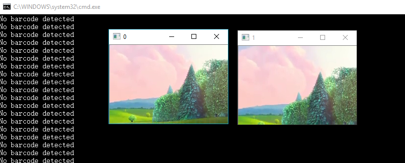

# Barcode Reader with OpenCV.Net
Use [OpenCV.Net](https://www.nuget.org/packages/OpenCvSharp3-AnyCPU) and [Dynamsoft Barcode Reader](https://www.dynamsoft.com/Products/Dynamic-Barcode-Reader.aspx) to create a barcode reader app on Windows.

## Environment
* Visual Studio 2015

## How to Run
1. Load the project to Visual Studio.
2. Connect a webcam to PC.
3. Build and run the app. Use 'ESC' to quit the app.

